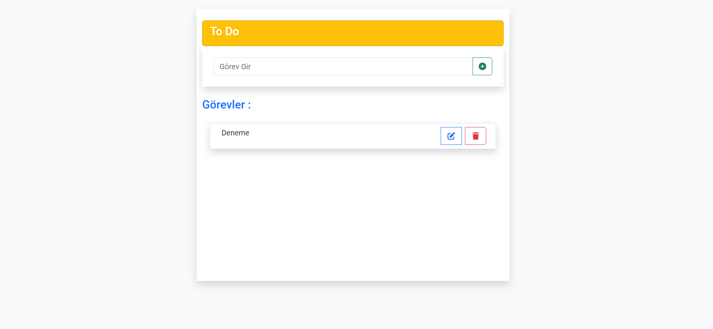

# AngularTodo

Bu proje, [Angular CLI](https://github.com/angular/angular-cli) sürüm 16.1.6 ile oluşturulmuştur.

## Geliştirme Sunucusu

Geliştirme sunucusu için `ng serve` komutunu çalıştırın. Tarayıcınızı  `http://localhost:4200/` adresine yönlendirerek, kaynak dosyalarınızdan herhangi birini değiştirdiğinizde uygulama otomatik olarak yeniden yüklenecektir.

## Kod Oluşturma
Yeni bir bileşen oluşturmak için `ng generate component component-name` komutunu kullanabilirsiniz. Ayrıca `ng generate directive|pipe|service|class|guard|interface|enum|module` kullanabilirsiniz.

## Derleme
Projeyi derlemek için `ng build` komutunu çalıştırın. Derleme ürünleri `dist/` dizininde saklanacaktır.
Run  to build the project. The build artifacts will be stored in the  directory.

## Birim Testleri Çalıştırma
Birim testleri [Karma](https://karma-runner.github.io). üzerinden çalıştırmak için `ng test` komutunu kullanın.

## Uçtan Uca Testleri Çalıştırma
Uçtan uca testleri çalıştırmak için `ng e2e` komutunu kullanabilirsiniz. Bu komutu kullanmak için öncelikle uçtan uca test yeteneklerini uygulayan bir paketi eklemeniz gerekmektedir.

## Daha Fazla Yardım
Angular CLI hakkında daha fazla yardım almak için `ng help` komutunu kullanabilir veya [Angular CLI Overview and Command Reference](https://angular.io/cli) sayfasını ziyaret edebilirsiniz.

## Uygulama Arayüzü

